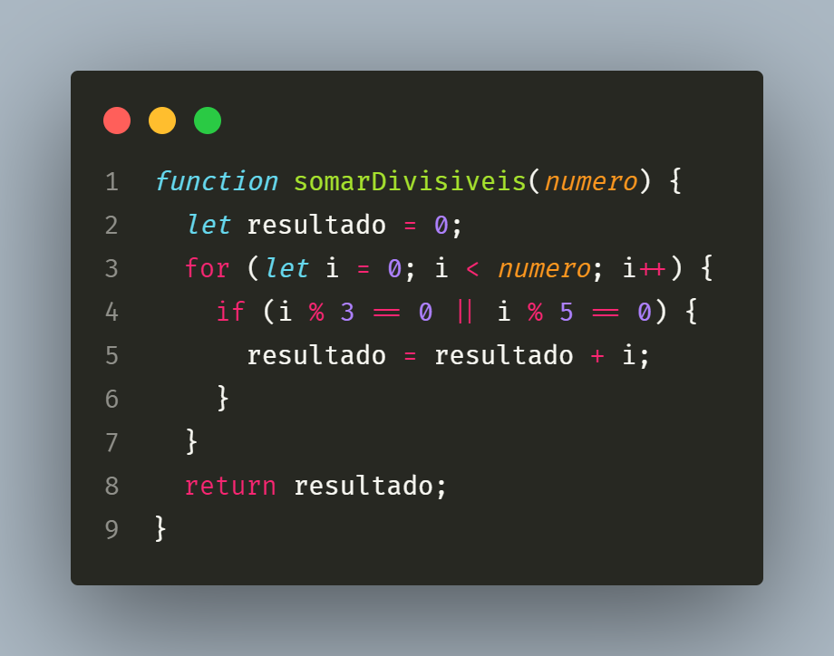

# Desafios

Repositório criado para documentação da resolução de desafios

## Escribo

Desafio que consiste em retornar o somatório de todos os valores inteiros divisíveis por 3 ou 5

[+ Ver desafio](Escribo/DESAFIO.md)

